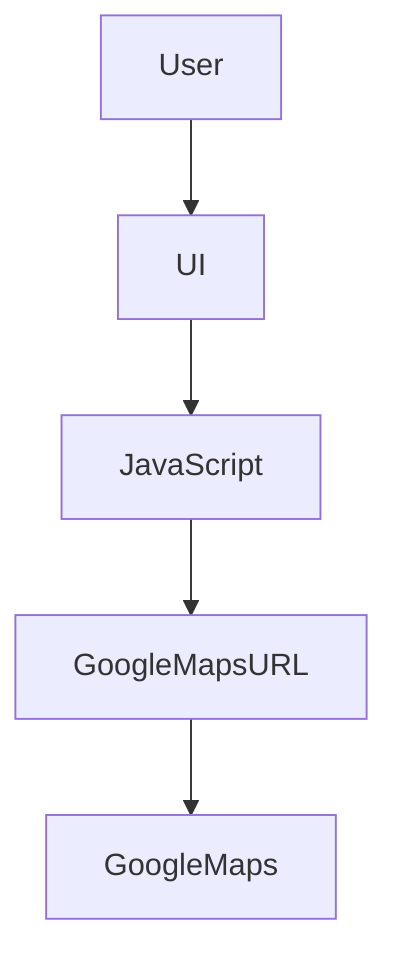

# 📍 SJCE-NAV-WEB

A web-based **interactive campus navigation system** designed for **St. Joseph’s College of Engineering (SJCE), OMR, Chennai**.

This project helps students, visitors, and faculty easily locate departments, facilities, and event venues using a simple interface that connects directly to Google Maps for routing.

---

## 🚀 Live Demo

➡️ If deployed, include your link here:

**[https://makeathon-psi.vercel.app/](https://makeathon-psi.vercel.app/)**

---

## 📌 About

**SJCE-NAV-WEB** is a lightweight front-end web application built using core web technologies.

It provides campus wayfinding support by allowing users to:

✔ Select a department or facility
✔ Generate Google Maps directions
✔ Navigate from the **SJCE Main Entrance**
✔ Access the system from mobile or desktop

The system is simple, fast, and does not require login or installation.

---

## 🧠 Features

### 🌟 Core Features

* 🗺️ Dropdown-based location selection
* 📍 Automatic Google Maps routing
* 🚗 Directions start from SJCE Main Entrance
* 📱 Responsive design (Mobile + Desktop)
* 🎨 Clean and simple UI

### ✨ Planned / Future Enhancements

* 🔎 Smart search with auto-suggestions
* 🌐 Multi-language support (Tamil / English)
* 📌 Indoor floor plans
* 🗂️ Admin panel for updating locations
* 📲 Progressive Web App (PWA) support

---

## 🛠️ Tech Stack

This project is built using:

* **HTML** – Page structure
* **CSS** – Styling and layout
* **JavaScript** – Navigation logic
* **Google Maps Direction Links** – Route generation

### 📊 Language Breakdown (GitHub)

* HTML – 87.7%
* CSS – 9.2%
* JavaScript – 3.1%

---

## 📁 Project Structure

```
SJCE-NAV-WEB/
│
├── index.html        # Main UI
├── sample.css        # Styling file
├── sample.js         # Navigation logic
├── sample.html       # Prototype/testing page
├── Engg Logo1.png    # College logo
├── clg3.jpg          # Background image
├── docs/             # Documentation (if used)
└── README.md
```

---

## ⚙️ How It Works

1️⃣ User opens `index.html`
2️⃣ Selects a destination from dropdown
3️⃣ Clicks “Get Directions”
4️⃣ JavaScript generates a Google Maps URL
5️⃣ A new tab opens with navigation route

---

## 🧠 System Architecture



---

## 🧭 Example Routing Format

```
https://www.google.com/maps/dir/SJCE+Main+Entrance/<Destination>
```

---

## 📦 Installation

No installation required.

1. Clone the repository:

```
git clone https://github.com/Mahaselvan/SJCE-NAV-WEB.git
```

2. Open `index.html` in any browser.

That’s it.

---

## 🎯 Target Users

* 🎓 New Students
* 👨‍👩‍👧‍👦 Parents
* 🧑‍💼 Recruiters
* 🎉 Event Participants
* 👩‍🏫 Faculty

---

## 👨‍💻 Author

**Mahaselvan S**
Information Technology Student
St. Joseph’s College of Engineering

GitHub: [https://github.com/Mahaselvan](https://github.com/Mahaselvan)

---

## 📜 License

This project is developed for academic and demonstration purposes.

---


Tell me what vibe you want 😄
